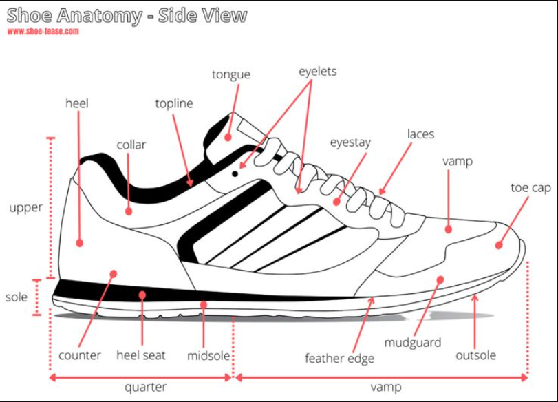

# Shoe 2 Map

This very important piece of software was created to classify which "shoe part" each city corresponds to. 
We can identify 5 categories: 
* Converse
* Lace
* Sole
* _Trou du lacet de la chaussures_
* Chewing gum

## Shoe Anatomy

## How to help with the data ?

* Go to [shoe2map](https://www.google.com/maps/d/edit?mid=1REnaBNvSwvU5zCNDEfFJT7n1qDuL3CM&usp=sharing) which is an editable map.
    * _It can only be edited if you are currently signed in with a Google_
* Add a _point_ 
    * Write a label
    * Add a categorie
        * _converse_
        * _lacet_
        * _trou_lacet_
        * _sole_
        * _chewing_gum_
* And after a few seconds *Voila* !

## Developpement Plan :  

* [ ] **UI**
    * [x] map interaction
        * [x] edit
        * [x] hover
        * [x] select
        * [x] style
        * [ ] _more_ ??
    * [x] shoe interaction
        * [x] entire shoe
        * [x] shoe part
            * [x] lace
            * [x] chewing gum
            * [x] sole
            * [x] lace hole
            * [ ] tongue 
            * [ ] _more_ ??
    * [ ] binded interaction
        * [x] select on map => imapct on shoe
        * [ ] select on shoe => impact on map
        * [ ] voting system
* [ ] **Data**
    * [x] City data
    * [ ] vote data
    

 
